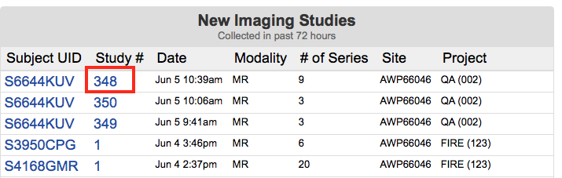
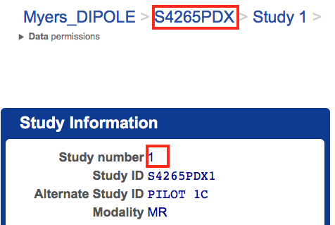

# Siemens Auto Voxel

## Overview
The `auto_voxel` script calculates the position of a predefined standard (MNI) space VOI in subject space through a linear transformation and prints out the Siemens position and orientation information for entry at the Syngo interface.

## Usage

### At the scanner console
- Acquire a sag T1-weighted volume with whole brain coverage
- Send the T1 series to NiDB

### On the iMac in the console room

#### Find the scan in NiDB
You need three identifiers from NiDB:

1. The `Subject UID`
2. The session number
3. The series number of the T1 you want to use for alignment

First, wait for the new data to appear on the main NiDB page. When the data you have just acquired appears, click on the corrsponding `Study #`.


You'll be taken to the study page. Note the `Subject UID` (which does not end in a number), and `Study number`.



Further down, locate the series number of the T1 you want to use. Some T1 acquistions will generate two seemingly identical series (as shown below). In this case, the later series number is a good choice.


#### Run the script

Open Terminal and type `remote_auto_voxel.sh SubjectUID StudyNumber Series TD`, where

- `SubjectUID`, `StudyNumber`, `Series` are taken from NiDB as above


#### Wait

The script will take about 5 minutes to run. Ideally you have structured your scan protocol to make use of this time, e.g. by first collecting a low resolution T1 for alignment and then running the script while high resolution T1 and T2 volumes are acquired.


#### Output

When the script is done, the end of the output will contain something like below. Pass this information to the tech.

The VOI dimensions are for informational purposes only, but should be close to your desired VOI dimensions (the transformation is rescaled to preserve the VOI size).


```
======== IFG ========
Orientation: Tra>Sag 2.4 >Cor -1.3
Rotation: -8.2 deg
Position: -23 29 22 mm
          L23 A29 H22
================

======== STG ========
Orientation: Tra>Sag 9.0 >Cor 1.0
Rotation: 0.3 deg
Position: -30 -12 7 mm
          L30 P12 H7
================


```


## Technical details

1. Conversion from DICOM using `dcm2niix`
2. Skull stripping using ROBEX
3. Alignment to the 2mm MNI template using FLIRT
4. The mni2native transform is inverted and applied to the predefined VOI matrix
5. Siemens parameters are calculated using `autovps.Transform`

# Printer Configuration

1. Install the dymo printer
2. Enable CUPS webinterface: `cupsctl WebInterface=yes`
3. Open [http://localhost:631/printers](http://localhost:631/printers)
4. Set default options to 
	- Media Size = `30374 Appointment Card`
	- Continuous Paper = `Enabled`
	- Print Quality = `Text Only`

